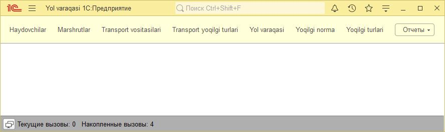

1C: Korxona — Yo'l Varaqalari va Odometer Nazorati Tizimi
Ushbu mini-loyiha 1C:Enterprise platformasining imkoniyatlarini namoyish etish uchun ishlab chiqilgan. Tizim avtotransport vositalarining harakatini, odometer ko'rsatkichlarini va masofa (probeg) hisobini avtomatlashtirishga qaratilgan.

🚀 Asosiy Imkoniyatlar
Odometer nazorati: Avtotransport vositalarining har bir safar oldidan va keyingi kilometrajini tizimli yuritish.

Yoqilg'i me'yorlari: Har bir transport uchun alohida yoqilg'i turlari va sarf me'yorlarini belgilash.

SKD Hisobotlar: Masofa bo'yicha tahliliy ma'lumotlarni shakllantirish.

Managed Forms: Zamonaviy boshqariladigan shakllar interfeysi.

🏗 Loyiha Strukturasi (Metadata)
📁 Ma'lumotnomalar (Справочники)
ТранспортВоситалари — Avtopark ro'yxati.

Хайдовчилар — Haydovchilar bazasi.

Маршрутлар — Doimiy yo'nalishlar.

ЁкилгиТурлари — Yoqilg'i turlari (Benzin, Metan, Dizel va h.k.).

📄 Hujjatlar (Документы)
ЙулВаракаси — Asosiy xo'jalik operatsiyasi. Masofa, haydovchi va transport ma'lumotlarini bog'laydi.

📊 Registrlar (Регистры)
ТранспортЁкилгиТурлари (Сведений): Transportga biriktirilgan yoqilg'i turlari.

ЁкилгиНорма (Сведений): Oylik kesimda yoqilg'i sarfi normalari.

ОдометрХолати (Сведений): Registratorga bo'ysungan holda odometer ko'rsatkichlari tarixi.

ПробегОбороти (Накопления): Umumiy bosib o'tilgan masofa bo'yicha aylanma ma'lumotlar.

📈 Hisobotlar (Отчеты)
ПробегХисоботи — Ma'lumotlar kompozitsiyasi tizimi (СКД) yordamida yaratilgan, haydovchilar va transportlar kesimidagi tahliliy hisobot.
